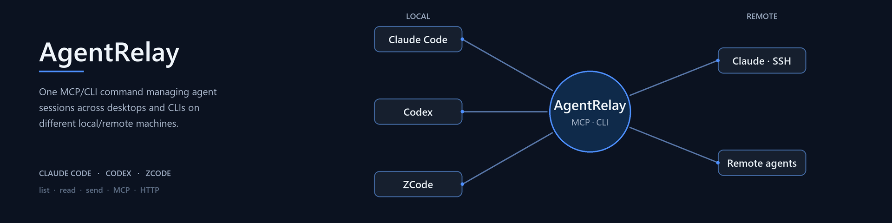

# AgentRelay



**English** · [中文说明](#中文说明)

One MCP/CLI command managing agent sessions across desktops and CLIs on different local/remote machines — **Claude Code**, **Codex**, **ZCode**, and **OpenCode**.

```
$ agentrelay list
AGENT   SESSION                                    TITLE                                 WORKSPACE       UPDATED
------  -----------------------------------------  ------------------------------------  --------------  --------
zcode   sess_5027cd0f-689f-4576-8509-8a76ac51fa36  Cross-session messaging PoC           C:\…\default    just now
claude  275c102a-8cf7-4720-935d-96b6ddfd0af3       Frontend design review                F:\Bob          1h ago
codex   01a07b4b-bc27-7fd1-89c0-dae8c883bf06       Add topic search to the course page   F:\Saba         5h ago

$ agentrelay send 01a07b4b-bc27-7fd1-89c0-dae8c883bf06 "Research is done, please continue with the next step"
(the target session receives a real user turn; its reply is printed here)
```

`send` delivers a **genuine user turn** to the target session. By default it is
fire-and-forget (the reply lands in the transcript; `--wait` blocks for it), and
for zcode it is CDP-first: when the desktop app runs with
`--remote-debugging-port`, the message enters through the app's real composer
(live refresh, native chain, steer of a running turn), otherwise it runs
headless. This is the building block for cross-agent orchestration: let a ZCode
session drive a Claude session, script hand-offs between agents, or poke a
long-running session from CI.

## Install

Requires Node.js ≥ 22.13 for normal invocation (uses built-in `node:sqlite`).
Node 22.5–22.12 requires `--experimental-sqlite`; newer Node LTS is recommended.

```bash
npm install -g github:wwy155/agent-relay
```

or from a clone:

```bash
git clone https://github.com/wwy155/agent-relay
npm install -g ./agent-relay
```

or run in place without installing: `node bin/agentrelay.js …`

## 分布式通信：真实 TUI 输入，而不是后台续跑

新增的 `relay` 命令与旧的 `send` 独立：旧 `send` 的 Claude/Codex
后台 resume **不保证当前 TUI 可见**；需要可见输入请使用下面的终端托管方式。

架构：发送端 → 带鉴权的 Hub / SQLite 消息队列 ← 各机器主动轮询的 Node
→ 本机白名单目标。机器之间不需要互相开放端口；只需要能通过 SSH 转发访问
同一个 Hub。没有任何可互通路径时，仍需要一台可达的 SSH 跳板机或组网服务。

### 1. 启动 Hub

```powershell
npm install
# 生成一次；通过可信渠道把同一个 token 配置到各参与机器，不要提交到 Git。
node bin/agentrelay.js relay token
$env:AGENTRELAY_TOKEN = '<上一步生成的 token>'
node bin/agentrelay.js relay hub --port 9330
```

Hub 默认仅监听 `127.0.0.1`。客户端配置 `AGENTRELAY_URL`，默认
`http://127.0.0.1:9330`；token 从环境读取，不需要出现在命令参数中。
Unix shell 使用 `export AGENTRELAY_TOKEN='...'`。

如果 Hub 在可 SSH 登录的跳板机上，每台内网机器建立本地转发：

```sh
ssh -NT -o ExitOnForwardFailure=yes -o ServerAliveInterval=30 \
  -L 127.0.0.1:9330:127.0.0.1:9330 user@jump-host
```

如果 Hub 本身在内网 A，A 先把 Hub 反向映射到跳板机：

```sh
# A：跳板机 19330 -> A 的 9330
ssh -NT -o ExitOnForwardFailure=yes -o ServerAliveInterval=30 \
  -R 127.0.0.1:19330:127.0.0.1:9330 user@jump-host
# B/C：本机 9330 -> 跳板机 19330 -> A
ssh -NT -o ExitOnForwardFailure=yes -o ServerAliveInterval=30 \
  -L 127.0.0.1:9330:127.0.0.1:19330 user@jump-host
```

这些是长运行连接，请用系统服务或自己的 SSH supervisor 保活。Node 会在网络
恢复后继续轮询，但不会替你配置 SSH 认证或重启 SSH。无需启用 `GatewayPorts`，
不要把转发监听改成 `0.0.0.0`。

### 2. 托管需要接收消息的真实终端

```sh
node bin/agentrelay.js terminal --name coder -- codex
node bin/agentrelay.js terminal --name reviewer -- claude
node bin/agentrelay.js terminal --name builder -- opencode
```

`--` 后是本机可执行程序及参数，不是远端下发的 shell 命令。Windows 的 npm
启动器如果只有 `.cmd`，显式启动本机 shell，例如：

```powershell
node bin/agentrelay.js terminal --name reviewer -- cmd.exe /d /s /c claude
```

包装器使用 `node-pty`（Windows ConPTY / Unix PTY），原样转发终端显示、键盘、
窗口大小。远端消息通过真实 bracketed paste 输入，`submit` 再单独发送 Enter，
`draft` 仅填入输入框。消息中的控制字符会被拒绝；目标必须启用 bracketed paste，
否则拒绝注入。不能把任意已经打开的非托管终端自动接管。

**输入控制默认锁定：**

- 先在真实 TUI 中确认焦点是空的对话输入框，按 `Ctrl-]` 后按 `c` 确认。
- `Ctrl-]` 后按 `a`：允许下一条远端消息。
- `Ctrl-]` 后按大写 `A`：明确授权连续远端消息，适合 Agent 间往返通信。
- `Ctrl-]` 后按 `l`：锁定。普通本地键盘输入会撤销远端授权。
- `draft` 后锁定，避免后续消息覆盖或误提交草稿；清空/处理草稿后重新确认并授权。

这里没有通用的“模型忙碌/输入框焦点识别”：连续模式中消息可能被不同 TUI 当作
steer 或排队输入。授权前确认 TUI 状态，不要在密码框、权限确认框或 shell 上授权。
包装器证明的是输入已写入 PTY，不是模型已接受或完成请求。

### 3. 配置本机目标并启动 Node

包装器在 stderr 打印 descriptor 路径，默认
`~/.agentrelay/terminals/coder.json`。把该 JSON 对象放到本机 `targets.json`
的目标名下；例如：

```json
{
  "coder": {
    "type": "terminal",
    "socket": "<descriptor 中的 socket>",
    "secret": "<descriptor 中的 secret>"
  },
  "desktop": {
    "type": "zcode",
    "sessionId": "<本机 ZCode 会话 ID>"
  }
}
```

descriptor 含本机注入凭证，勿公开。终端重启后重新复制 descriptor，并重启
Node 加载配置。每台机器使用不同的 Node ID 和自己的数据目录：
异常退出可能留下 descriptor：必须先确认旧包装器已经停止，才能删除该文件并重新
启动；工具不会覆盖可能属于活跃终端的凭证。

```powershell
$env:AGENTRELAY_TOKEN = '<同一个 token>'
node bin/agentrelay.js relay node --id laptop-b --targets .\targets.json
```

ZCode 桌面目标仅支持 `submit`，要求 Windows 和已开启的本机 CDP 调试端口。
分布式路径采用单次、严格桌面投递；找不到唯一目标或安全输入框时拒绝，
不降级为后台运行。CDP 属于高权限接口，只能绑定本机或受保护的隧道。
要求当前 ZCode v4 的精确 session-id DOM 标记；旧版或变更后的 UI 将拒绝投递。
桌面目标可配置 `cdpPort`（默认 9222）和 `cdpTargetId`；多个 CDP 页面存在时必须
明确指定页面 ID（从本机 `http://127.0.0.1:9222/json` 查看）。

### 4. 发消息、查状态、让 Agent 回信

```sh
node bin/agentrelay.js relay nodes
node bin/agentrelay.js relay send laptop-b coder "请检查接口，并把结论发回 laptop-a 的 planner"
node bin/agentrelay.js relay send laptop-b coder "这是一条待确认草稿" --mode draft
node bin/agentrelay.js relay status <返回的消息ID>
```

`--id <UUID>` 提供幂等提交：同 ID、同内容返回原消息，不重复排队；
同 ID、不同内容报冲突。发送端超时后应使用原 ID 重试，不能随意生成新 ID。

在现有 stdio MCP 配置的进程环境中设置 `AGENTRELAY_URL` / `AGENTRELAY_TOKEN`，
即可使用新增的 `relay_nodes`、`relay_send`、`relay_status`。例如 Claude Desktop：

```json
{ "mcpServers": { "agentrelay": {
    "command": "node",
    "args": ["C:\\path\\to\\agent-relay\\bin\\agentrelay.js", "mcp"],
    "env": { "AGENTRELAY_URL": "http://127.0.0.1:9330", "AGENTRELAY_TOKEN": "<同一个 token>" }
} } }
```

不配置这两个环境变量也不影响本地的 `send_message` / `list_sessions` /
`read_session`——那四个工具从不经过 Hub；只有 `relay_*` 三件套需要。
`relay_send` 参数为 `{to, target, text, mode?, id?}`。双方 Agent 均配置该 MCP，
就能互相发送；回信是显式发送到对方机器/目标的另一条消息，不自动抓取终端输出、
不把工具日志误当最终答案，也不会自动触发无限回信。

**收发语义与安全边界：**

- `queued`：Hub 已持久保存，离线目标恢复后可接收。
- `delivering`：已领取，正在尝试 UI 输入。
- `delivered`：输入投递成功；不代表模型完成。详情区分 submitted / drafted。
- `failed`：投递失败，检查错误和本机授权状态。
- `uncertain`：崩溃、超时等导致无法证明是否已输入；先看目标界面，不能盲目重发。
- Hub 队列、本机收据持久化；不能把外部 UI 操作与数据库事务原子提交，因此不承诺
  exactly-once。对于不确定的输入，宁可要求人工核实，也不自动重复提交。
- token 是整个中继的共享信任边界，不是多租户隔离。持有 token 的客户端可向所有
  白名单目标发消息和读取中继消息；只授权可信机器。敏感提示词会落盘。
  token 同时授权内部节点领取/回执接口，持有者可以冒充节点，不能给不可信租户。
  必须一起保留 Hub 数据库和 Node 收据数据库；仅恢复其中之一无法保证历史对账。
- 远端不能指定任意进程、shell、socket；目的地只能是 Node 本地配置的目标名称。
- 目前不提供通用桌面注入：严格桌面适配为 ZCode；其他桌面程序需要对应适配器。

运行回归验证：`npm test`。原有本机会话管理命令保持原语义。

验证范围：Windows 上验证了真实 PTY 的中文多行提交、输入锁、草稿保护，以及实际
Codex TUI 的可见草稿注入；Hub 重启恢复、幂等提交、鉴权和崩溃不重放有回归覆盖。
严格桌面 CDP 在隔离浏览器页面验证提交/草稿拒绝，并只读检查了本机 ZCode DOM；
没有向已有 ZCode 会话发送测试消息。另已在 Linux 上通过回归测试，并通过真实 SSH
反向隧道验证 Windows → Linux OpenCode 1.18.31 的可见提交与模型回复，以及远端
OpenCode 经 MCP → Windows OpenCode 的可见草稿回信。macOS 和 Claude TUI 尚未实测。

## Commands

| Command | What it does |
|---|---|
| `agentrelay list [query...] [--agent zcode\|claude\|codex] [--limit N] [--json]` | Unified session table with **fuzzy search** (agent/id/title/workspace, space-separated AND); top 30 by default, `--limit N` overrides |
| `agentrelay read <sessionId> [--agent A] [--last N] [--json]` | Last turns of any session, system noise filtered |
| `agentrelay send <sessionId> <message...> [--agent A] [--timeout ms] [--json]` | Deliver a real user turn and print the reply (opencode targets steer the exact session live — never forked — and stream the turn in the CLI; blocking by default, `--no-wait` detaches) |
| `agentrelay paths` | Show detected storage locations and CLI paths |
| `agentrelay oc-serve [dir] [--port N]` | Pre-warm a project's shared OpenCode server (normally unnecessary because `send` starts it automatically) |
| `agentrelay oc-attach [dir] [--port N]` | Open a live OpenCode TUI on the project's shared server, starting the server when needed |
| `agentrelay mcp` | Run as a stdio MCP server exposing the same operations as tools |

Session ids are matched across all four agents automatically; pass `--agent`
when an id could be ambiguous or to skip the full scan.

## Use as an MCP server

`agentrelay mcp` runs a stdio MCP server exposing `list_sessions`,
`read_session`, `send_message`, `get_paths` — so any MCP client can drive your
other agents. Three distributed-messaging tools (`relay_nodes`, `relay_send`,
`relay_status`) light up as well when the process has `AGENTRELAY_URL` +
`AGENTRELAY_TOKEN` set (see the 分布式通信 section). Wire it in (adjust the path
to your install):

Claude Code:

```bash
claude mcp add agentrelay -- node /path/to/agent-relay/bin/agentrelay.js mcp
```

Claude Desktop (`%APPDATA%\Claude\claude_desktop_config.json`):

```json
{ "mcpServers": { "agentrelay": {
    "command": "node",
    "args": ["C:\\path\\to\\agent-relay\\bin\\agentrelay.js", "mcp"]
} } }
```

Codex (`~/.codex/config.toml`):

```toml
[mcp_servers.agentrelay]
command = "node"
args = ['C:\path\to\agent-relay\bin\agentrelay.js', 'mcp']
```

ZCode (`~/.zcode/cli/config.json`):

```json
{ "mcp": { "servers": { "agentrelay": {
    "command": "node",
    "args": ["C:\\path\\to\\agent-relay\\bin\\agentrelay.js", "mcp"]
} } } }
```

OpenCode (`~/.config/opencode/opencode.jsonc`):

```json
{ "mcp": { "agentrelay": {
    "type": "local",
    "command": ["node", "C:\\path\\to\\agent-relay\\bin\\agentrelay.js", "mcp"],
    "enabled": true
} } }
```

`send_message` is fire-and-forget by default (see above); `wait:true` blocks. All caveats apply
below — it appends to the target session's real history and spends its tokens.

### OpenCode sends — direct steer, live in the CLI

`send` to an opencode session runs `opencode run -s <id>` with the message
over stdin: a genuine user turn in **that exact session**, never `--fork`ed
(a fork would divert the turn into a copy the live session never sees). The
CLI streams the turn live — session header, tool progress, then the reply —
so a steer is visible the moment it happens:

```
$ agentrelay send ses_f4fa6e7b... "Continue with the next step"
> build · muse-spark-1.3-contributor-free
→ Read src/index.ts
Done, next step implemented.
[session: ses_f4fa6e7b...]
```

Blocking is the default for opencode targets; `--no-wait` detaches into the
background (reply lands in the transcript; `read` to review). With `--json`
the live stream goes to stderr and the final reply stays clean on stdout.

### OpenCode live TUI delivery — the shared server (automatic)

`opencode run` boots a **throwaway instance** each time: two instances share
nothing but the SQLite file, so a TUI already open on the session shows the
delivered turn only after you reopen it — the same staleness zcode's desktop
had. OpenCode's own fix is a persistent server: it is the single event source
and pushes every turn over SSE to TUIs attached to it.

AgentRelay rides that with zero manual steps: every `send` to an opencode
session **ensures the project's shared server by itself** — reuse when up,
start when missing — then posts `POST /session/<id>/message`, so **every
attached TUI shows the turn live**: the user message, tool progress, the
streaming reply.

```
$ agentrelay send ses_f4fa6e7b... "Continue with the next step"
opencode server started for F:/Saba - live TUI: opencode attach http://127.0.0.1:44231
Done, next step implemented.
[session: ses_f4fa6e7b...]
$ agentrelay oc-attach F:/Saba             # opens the live TUI; no URL lookup or paste
```

- The attach hint prints exactly once, when the send booted the server.
  Later sends reuse it silently.
- `serve` is project-scoped, so each directory gets a **deterministic port**
  derived from the path (44000-44996); sender and server derive it
  identically, no registry. `AGENTRELAY_OPENCODE_URL` overrides the probe,
  `AGENTRELAY_OPENCODE_NOSERVE=1` disables auto-start entirely.
- The adapter verifies the target session actually lives on the probed server
  (port-collision guard) before posting.
- No server possible? Transparent fallback to the `run` paths above —
  delivery always works, live refresh is the upgrade.
- Blocking sends return the finished reply from the server; `--no-wait` posts
  through a detached helper so the turn survives the CLI exiting.
- `agentrelay oc-serve [dir] [--port N]` only pre-warms the server (and
  prints the attach line) without sending. Same behavior flows through MCP
  `send_message` automatically — one interface, CLI and MCP alike.
- `agentrelay oc-attach [dir] [--port N]` is the one-step viewer command: it
  starts the same server when needed and attaches a TUI in the current terminal.

### Fresh sessions — recommended for agent-to-agent traffic (zcode)

`agentrelay send --fresh <message>` runs the message in a **brand-new** zcode
session (headless, synchronous reply, `sessionId` returned). New sessions appear
in the desktop app's task list automatically, and opening one loads its full
transcript — so your agent traffic stays visible in the desktop without ever
injecting into a conversation the user has open (which the app would not
re-render anyway: it keeps open sessions in memory and never re-reads the DB).

```
$ agentrelay send "Summarize the API research" --json
{ "ok": true, "sessionId": "sess_...", "reply": "..." }
```

`send` with no sessionId defaults to this; `--fresh` is the explicit form.

Sends are **fire-and-forget by default** (reply lands in the transcript; `--wait`
blocks for it). For zcode, sends are **CDP-first by default**: when the desktop app runs with
`--remote-debugging-port`, messages go through the app's real composer — live
refresh, native chain, steer of a running turn — at the cost of the app
switching to that conversation; when the debug port is absent they fall back to
silent headless automatically. `--no-desktop` (CLI) / `desktop: false` (MCP)
forces silent headless with no view switch. claude/codex sends are always
headless (plus remote-SSH injection for claude remote sessions).

For a continuing back-and-forth, keep resuming that fresh session's id with the
normal `send <id>` — it is a headless session no desktop tab holds, so nothing
can go stale.

### Remote agents (e.g. Claude Code on an SSH server) - HTTP transport

stdio MCP servers can only be spawned by local clients. For agents running on
another machine, AgentRelay also speaks streamable HTTP:

```powershell
# on the Windows machine (one-time per boot):
powershell -ExecutionPolicy Bypass -File tools
elay-remote-up.ps1 -SshHost root@your-server
# starts: local MCP on 127.0.0.1:9321 + an SSH reverse tunnel server:9321 -> local:9321
```

Then on the server, register it in Claude Code (`~/.claude.json`):

```json
{ "mcpServers": { "agentrelay": { "type": "http", "url": "http://127.0.0.1:9321/mcp" } } }
```

The remote agent gets the same four tools operating on your **local** sessions.
Traffic stays inside the SSH tunnel; both endpoints bind localhost only.
## How it works (the interesting parts)

### ZCode provides no session API - how sending was made possible

ZCode desktop keeps every conversation in a local SQLite database
(`~/.zcode/cli/db/db.sqlite`, `message` + `part` tables). AgentRelay reads
sessions straight from that DB. Sending required reverse-engineering three
delivery routes:

- **Headless resume**: the CLI bundled with the desktop app
  (`zcode.cjs --resume <id> --prompt`) materializes the session in its own
  process and runs the turn there. Needs a model provider in
  `~/.zcode/cli/config.json` (`"model": "provider/model-id"`); the desktop app's
  copy under `~/.zcode/v2/config.json` is not read by headless runs.
- **Why the desktop window does not refresh on external writes**: the app is a
  single-writer architecture. The UI renders state held in its app-server's
  memory; the database is its persistence log, not a shared bus. External
  inserts are never re-read (verified: queue-table rows written by outside
  processes stay unclaimed; there is no TCP/pipe control surface; injecting a
  row into the internal session_input queue is ignored). Messages still land and
  the agent still processes them - only the open window does not repaint.
- **CDP route (the default; the only visible route)**: start the app with
  `--remote-debugging-port=9222` and AgentRelay drives the renderer directly -
  locate the session row in the sidebar, focus the composer, insert the message
  as trusted input, press Enter. The turn runs *inside* the app: live refresh,
  native message chain, and with `zcodeInteractionBehavior: "guide"` a message
  arriving mid-turn steers the running agent instead of queueing. Works while
  the window is backgrounded or minimized (renderer-level events, no OS focus
  steal). This is the only way to deliver into a conversation the user has open.
  Headless is now opt-in only (`--no-desktop` / `desktop: false`); a CDP failure
  surfaces as an error instead of silently degrading.

### Remote (SSH) Claude sessions - reading a mirror, writing to the live brain

Claude sessions on SSH workspaces keep only a transcript mirror locally; the
live process (`ccd-cli --resume=<id> --input-format stream-json`) runs on the
server and consumes user turns from its stdin. AgentRelay:

1. resolves the host from the `ssh:<host>:<cwd>` project keys in
   `~/.claude.json` (e.g. `ssh:root@1.2.3.4:/root/TokenGateway`);
2. finds the live runner over SSH by its `--resume=<id>` flag;
3. writes one stream-json user turn into `/proc/<pid>/fd/0`.

The turn executes inside the live process, so the reply streams back to the
Claude desktop in real time and the chain stays native.

### Remote agents driving local sessions

stdio MCP servers can only be spawned by local clients, so for agents on other
machines AgentRelay also speaks streamable HTTP, paired with an SSH reverse
tunnel (`tools/relay-remote-up.ps1`). The script listens on `127.0.0.1:9322`
locally (9321 is commonly taken by other desktop apps) and maps the remote's
unchanged `9321` onto it, so the remote client registers
`http://127.0.0.1:9321/mcp` and gets the same tools operating on your local
sessions; traffic never leaves the SSH tunnel.

### Desktop mode (zcode, Windows) — the only route, by design

A zcode `send` delivers through the **desktop UI over CDP**: it locates the
session in the desktop app's sidebar, focuses the composer, and types the
message in as renderer-level trusted input (no focus stealing). The turn runs
**inside the desktop app**, so its window updates live, the message chain stays
native, and if the session is mid-turn the message **steers** it (requires the
desktop setting `zcodeInteractionBehavior: "guide"`).

There is **no silent fallback**: if CDP delivery fails (app not running with
the debug port, session row not found, composer not reachable), the send
**errors out** — earlier versions quietly degraded to a headless run that could
use a different model than the session UI, or drop the message entirely when
headless was broken. The caller sees the real failure and can retry.
`--no-desktop` (CLI) or `desktop: false` (MCP) is the explicit headless escape
hatch for when you want that behavior on purpose.

One-time setup:

```powershell
# quit ZCode first (tray icon -> exit), then:
powershell -ExecutionPolicy Bypass -File tools\start-zcode-cdp.ps1
```

This relaunches the app with `--remote-debugging-port=9222` (CDP is a local
control surface — only enable it on a machine you trust). To make it permanent,
add that flag to your ZCode shortcut's Target instead.

Trade-offs: Windows only; the desktop app must be running with the CDP flag;
matches the session by title prefix; returns no reply text (the turn runs
asynchronously in the app).

## Where sessions come from & how sends are delivered

| Agent  | Sessions read from                     | Send channel                                     |
|--------|----------------------------------------|--------------------------------------------------|
| claude | `~/.claude/projects/**/*.jsonl`        | `claude --resume <id> -p` (prompt via stdin)     |
| codex  | `~/.codex/sessions/**/rollout-*.jsonl` | `codex exec resume <id> -` (prompt via stdin)    |
| zcode  | `~/.zcode/cli/db/db.sqlite`            | `zcode.cjs --resume <id> --prompt <msg>`         |
| opencode | `~/.local/share/opencode/opencode.db`  | `opencode run -s <id>` (message via stdin)       |

Everything runs locally against your existing installs; AgentRelay itself adds no
service, port, or daemon.

**Remote (SSH) Claude workspaces** appear in `list`/`read` with an `ssh:` prefix on
the workspace; subagent transcripts (`agent-*.jsonl`) are never listed as sessions.
`send` to a remote session is supported: AgentRelay resolves the SSH host from the
`ssh:<host>:<cwd>` keys in `~/.claude.json`, finds the live session runner process
(`--resume=<id>`) on that host, and injects the message into its stdin as a
stream-json user turn — the turn runs inside the live process, so the reply streams
to the desktop app in real time. If the session is not currently running, start it
once from the desktop app first. Codex and ZCode sessions are local; no remote
handling applies.

## Per-agent requirements

- **claude** — `claude` CLI on PATH, logged in, and its API endpoint reachable
  (check `ANTHROPIC_BASE_URL` if you use a relay).
- **codex** — `codex` CLI on PATH and authenticated (`~/.codex/auth.json`).
- **zcode** — the desktop install's `zcode.cjs` is auto-detected from
  `ZCODE_WINDOWS_APP_INSTALL_DIR` / `%LOCALAPPDATA%\Programs\ZCode`
  (override with `AGENTRELAY_ZCODE_CLI`). Headless sends additionally need a
  model provider in `~/.zcode/cli/config.json`:

  ```json
  {
    "provider": {
      "bigmodel": {
        "kind": "anthropic",
        "options": { "apiKey": "sk-...", "baseURL": "https://open.bigmodel.cn/api/anthropic" }
      }
    },
    "model": "bigmodel/GLM-5.3"
  }
  ```

  Note `"model"` must be a `"provider/model"` string. The desktop app keeps its
  own copy under `~/.zcode/v2/config.json`, which the headless CLI does **not**
  read — hence this file.

## Caveats

- `send` spends tokens on the target agent and permanently appends to that session's history.
- Sending to a session that is currently busy in its own UI may preempt the active turn.
- **Codex single-writer lock**: a codex session that is currently open in a Codex
  TUI/desktop holds its thread lock, and headless injection into it is refused by
  codex itself (`thread-store conflict`). Deliver in that TUI directly, or close
  the conversation first; `read` is unaffected. Sessions nobody has open send fine.
- **ZCode headless config is fragile across app updates**: headless runs need the
  provider config the bundled CLI resolves relative to its own directory — the
  desktop app has moved it between releases (e.g. `resources\glm\provider\`
  vs `resources\config\provider\`). If headless fails with "无法定位 CLI ZCode
  Built-in Provider Config", copy `zcode-builtin.json` to the path named in the
  error. Visible CDP delivery does not depend on this file.
- Session storage layouts are the agents' local, undocumented formats and may change between versions.
- Prompt payloads always travel via stdin or a directly-spawned process — never through a shell — so arbitrary quotes/newlines in messages are safe.

## 中文说明

**AgentRelay**：一个 MCP/CLI 命令，跨桌面端与 CLI、跨本地与远程机器，统一管理 **Claude Code / Codex / ZCode / OpenCode** 的 agent 会话。

- `agentrelay list [关键词...]` — 四家 session 混合列表 + **模糊搜索**（匹配 agent/ID/标题/工作区，多词 AND），默认 top 30，`--limit N` 覆盖
- `agentrelay read <sessionId>` — 读取任意 session 的最近对话（自动跨四家匹配 id）
- `agentrelay send <消息>` / `send <sessionId> <消息>` — 注入**真实用户回合**。默认异步
  （发完即返回，回复落在会话转录里，用 `read` 查看）；加 `--wait` 则阻塞等回复并打印。
  **opencode 例外**：直接 steer 目标会话原地执行（永不 `--fork`），CLI 默认阻塞并实时
  流式打印（头部、工具进度、回复），`--no-wait` 才走后台；`--json` 时实时流走 stderr，
  stdout 只留干净的最终回复
- `agentrelay oc-serve [目录] [--port N]` — 预热项目目录的**共享 opencode
  server**（确定性端口 = 目录哈希，44000-44996），并打印可直接粘贴的 attach
  命令。平时不需要手动跑：`send` 发往 opencode 会话时会自动起服、自动复用，
  首次起服时 CLI 只提示一次 attach 行；起不了服则自动回退 `opencode run`
  路径，投递永远可用（`AGENTRELAY_OPENCODE_NOSERVE=1` 可彻底关掉自动起服）
- `agentrelay oc-attach [目录] [--port N]` — 一步打开该项目共享 server 的实时
  TUI；server 未启动时会自动启动，不需要查端口或复制 URL
- `agentrelay paths` — 显示探测到的存储路径与 CLI
- `agentrelay mcp` — 以 stdio MCP server 运行：基础 4 工具（`list_sessions` /
  `read_session` / `send_message` / `get_paths`）接入 Claude Code、Claude Desktop、
  Codex、ZCode 等 MCP 客户端，配置示例见上方英文段；当进程环境配置了
  `AGENTRELAY_URL` + `AGENTRELAY_TOKEN` 时，还会启用分布式三件套
  `relay_nodes` / `relay_send` / `relay_status`（见「分布式通信」章节）
- Claude 的 SSH 远程会话：`list`/`read` 以 `ssh:` 前缀标识（子代理转录不会列为 session）；
  `send` 支持远程会话——自动从 `~/.claude.json` 解析主机，在远程主机上找到活运行进程
  （`--resume=<id>`），以 stream-json 用户回合注入其 stdin，回复实时流回桌面应用。
  若目标会话当前未运行，先在桌面应用里启动一次

安装：`npm install -g github:wwy155/agent-relay`（需 Node ≥ 22.5）。

**发送的前提**：claude 需要 `claude` CLI 在 PATH 且 API 可达；codex 需要 `codex` CLI 已认证；
zcode 自动探测桌面版自带的 `zcode.cjs`（可用 `AGENTRELAY_ZCODE_CLI` 指定），且
`~/.zcode/cli/config.json` 里要有 provider/model 配置（`model` 必须是 `"provider/model"` 字符串，
桌面端的 `~/.zcode/v2/config.json` 对无头 CLI 不生效），示例见上方。

**注意**：`send` 会消耗目标 agent 的模型额度并永久写入其 session 历史；给正在忙碌的
session 发送可能抢占当前轮次；session 存储格式是四家 agent 的本地私有格式，随版本可能变化。
**codex 单写入者锁**：正开在 Codex TUI/桌面里的会话持有线程锁，codex 自身会拒绝无头
注入（`thread-store conflict`）——请在那个 TUI 里直接发言，或先关闭该会话；`read` 不受影响。
**zcode 无头配置随桌面更新易失效**：无头运行依赖内置 CLI 按自身目录解析的 provider
配置文件，桌面版更新曾移动过该文件位置（`resources\glm\provider\` ↔
`resources\config\provider\`）。无头报「无法定位 CLI ZCode Built-in Provider Config」
时，把 `zcode-builtin.json` 复制到报错指出的路径即可；CDP 可见投递不依赖此文件。

**fresh 会话模式（默认的 agent 间通信）**：`agentrelay send <消息>`（不带 sessionId
即走此模式；`--fresh` 为显式形式）在一个
**全新** zcode 会话里执行消息（无头、同步拿回复、返回 sessionId）。新会话会自动出现在
桌面应用的任务列表里，点开即可读完整记录——agent 流量对桌面始终可见，且完全不碰
用户开着的会话（桌面不会重渲染已打开会话的外部写入）。需要多轮往来时，用普通
`send <id>` 续聊这个新会话即可——它没有被任何桌面标签页持有，不存在失效问题。

## 实现原理（重点）

### ZCode 没有官方 session API，发送是怎么做出来的

ZCode 桌面把全部对话存在本地 SQLite（`~/.zcode/cli/db/db.sqlite`，`message`+`part`
表）。读取直接查库；发送逆出了三条路：

- **无头 resume**：桌面自带的 CLI（`zcode.cjs --resume <id> --prompt`）在自己的进程里
  物化会话并执行回合。需要在 `~/.zcode/cli/config.json` 配模型
  （`"model": "provider/model-id"`）；桌面的 `~/.zcode/v2/config.json` 对无头无效。
- **为什么外部写入后桌面窗口不刷新**：桌面是"单写入者"架构——界面渲染的是 app-server
  内存里的状态，数据库只是它的持久化日志而非共享总线。外部插入永远不会被重读（实测：
  外部写的队列表行无人认领；无 TCP/管道控制面；直接插 `session_input` 也被无视）。
  消息其实已送达、agent 也处理了，只是开着的窗口不重绘。
- **CDP 路线（默认路线，也是唯一可见路线）**：桌面以 `--remote-debugging-port=9222`
  启动后，AgentRelay 直接驱动渲染层——侧边栏定位会话行、聚焦输入框、以受信任输入
  插入消息、回车。回合在应用**内部**执行：实时刷新、消息链原生；配合
  `zcodeInteractionBehavior: "guide"`，回合进行中到达的消息直接**抢占引导**运行中的
  agent 而非排队。窗口最小化/后台照常（渲染层事件，不抢 OS 焦点）。这是向"用户正
  开着的会话"投递的唯一途径。CDP 投递失败会**直接报错**，不再静默降级为无头
  （旧行为可能用不同模型跑、甚至在无头损坏时整条消息丢失）；`--no-desktop` /
  `desktop: false` 是显式的无头逃生通道。

### 远程（SSH）Claude 会话——本地是镜像，大脑在服务器

SSH 工作区的 Claude 会话在本地只有转录镜像；活进程
（`ccd-cli --resume=<id> --input-format stream-json`）跑在服务器上、从 stdin 消费用户
回合。AgentRelay：① 从 `~/.claude.json` 的 `ssh:<host>:<cwd>` 项目键解析主机；
② SSH 上去按 `--resume=<id>` 找活进程；③ 往 `/proc/<pid>/fd/0` 写一行 stream-json
用户回合。回合在活进程内执行，回复实时流回 Claude 桌面，链原生。

### 远程 agent 操控本地 session

stdio MCP 只能被同机客户端拉起，故另提供 HTTP 传输 + SSH 反向隧道
（`tools/relay-remote-up.ps1`）。脚本默认监听本地 `127.0.0.1:9322`（9321 常被
其他桌面应用占用），并把远程机器上不变的 `9321` 映射到本地 `9322`；远端注册
`http://127.0.0.1:9321/mcp` 即获得操作本地 session 的同一组工具，流量不出 SSH 隧道。

**远程 agent 接入（HTTP 传输）**：stdio MCP 只能被同机客户端拉起。跑在服务器上的
agent（如 SSH 里的 Claude Code）改用 HTTP 传输：Windows 上运行
`tools/relay-remote-up.ps1`（启动本地 `127.0.0.1:9322` 的 MCP + SSH 反向隧道
`服务器:9321 → 本地:9322`），再在服务器的 `~/.claude.json` 注册
`{"mcpServers":{"agentrelay":{"type":"http","url":"http://127.0.0.1:9321/mcp"}}}`。
远程 agent 即获得操作**本地** session 的同一组工具；流量全程走 SSH 隧道，两端只绑
localhost。重启电脑后需重跑 relay-remote-up.ps1。

**desktop 模式（zcode / Windows）**：默认 zcode 的 `send` 走无头进程，直接写数据库，
桌面窗口不会实时刷新。`agentrelay send <id> <消息> --desktop`（或 MCP 的 `desktop: true`）
改走 CDP：在桌面应用侧边栏定位会话 → 向真实输入框注入受信任输入事件 → 回车发送。
回合由桌面应用自己执行——**窗口实时刷新、消息链原生**；若该会话正在跑回合，消息会以
guide 模式抢占（运行中的 agent 立即看到；需桌面设置 `zcodeInteractionBehavior: "guide"`）。

一次性准备：托盘退出 ZCode 后运行 `tools\start-zcode-cdp.ps1`（以
`--remote-debugging-port=9222` 重启应用；CDP 是本地控制面，只在可信机器上开启；
也可把该参数加进快捷方式 Target 常开）。代价：仅 Windows、需桌面应用以此方式运行、
按标题前缀匹配会话、拿不到回复文本（回合在应用内异步执行）。

MIT licensed.
